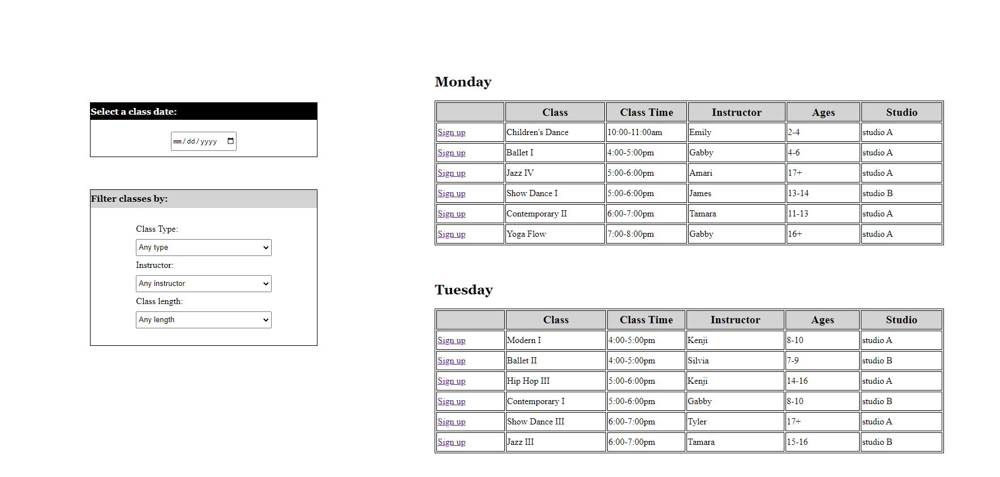
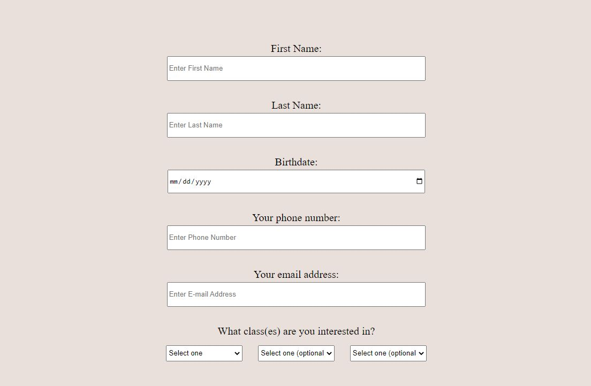
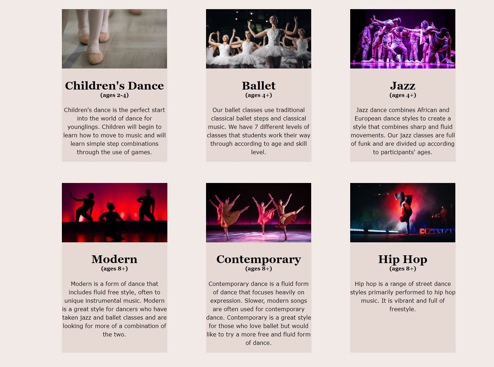

# Dance Company Website
> The purpose of this project was to practice using CSS Flexbox to create a mockup
of a dance company website.

## Table of Contents
* [General Info](#general-information)
* [Links](#links)
* [Technologies Used](#technologies-used)
* [Screenshots](#screenshots)
* [Project Status](#project-status)
* [Room for Improvement](#room-for-improvement)
* [Contact](#contact)

## General Information
This project was part of Module 1 of the coding bootcamp I attended. The task 
for this project was to practice using CSS Flexbox. The following elements
were required as part of the task:

- Include a functional navigation bar
- Include at least 3 pages and navigation to the pages
- Use CSS Flexbox in at least one section of the page
- Include sign in/log out forms
- Include at least one other form

Some elements I am particularly proud of:

- having a video as a hero image that automatically plays went the website is 
opened and is on a constant loop
- including many different links and buttons on the page to allow for easy 
navigation between pages
- including a table for the first time in a project
- including different types of inputs for the forms, including dates and dropdowns

## Links
- Live Demo URL: [https://marlisarebaum.github.io/gym-website/](https://marlisarebaum.github.io/gym-website/)

## Technologies Used

## Screenshots

#### First HTML Table I Created:

#### Form with Different Types of Input Fields:

#### Display of Classes Using CSS Flexbox:

## Project Status
Project is:  _complete_ 

## Room for Improvement
Although the given tasks were met, the following would improve the website:
- Use Flexbox to make the site fully responsive. Although Flexbox is used to 
create a grid describing the classes the dance studio offers, the rest of the 
site is not fully responsive. Flexbox could improve the user experience of 
viewing the site on a smaller screen.
- A backend would make the site fully functional. For example, the filter 
included on the "classes" page could be made fully functional to allow users to 
search for specific classes.
- A backend could be created for the "enroll" form to allow the studio to retrieve
information from newly enrolled students.
- A backend could allow users to actually log in to their account, sign up for 
classes, and log out (and the log out button would only appear when users are
logged in).
- The website should be tested for accessibility - some of the colors used, while
appealing, may not provide the correct contrast needed to make it accessible to 
all users.

## Contact
Created by [Marlisa Rebaum](https://www.linkedin.com/in/marlisarebaum/) - feel free to contact me!